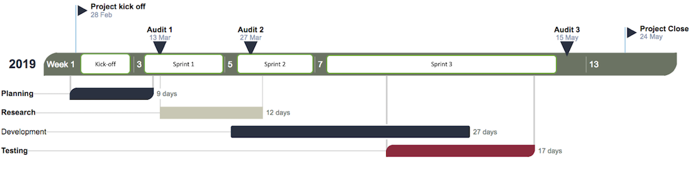

# SQL-Inverse-Multiplexer
The project is proposed by iCognition, a company based in Braddon.

The objective of this project is to improve the functionality of an existing software (Content Manager, developed by MicroFocus), to allow the collation of results from multiple database instances, and return them through a single query within the CM software.

## Project Members
| Name            | E-mail                      | Role(s)                               |
|:---------------:|:---------------------------:|:-------------------------------------:|
| Donghoon Chang  | u5342047@anu.edu.au         | Tester                                |
| Willy Ghozali   | u6272951@anu.edu.au         | Middleware Developer, Researcher      |
| Rahil Vora      | Rahil.Vora@anu.edu.au       | Researcher                            |
| Scarlett Qin    | Sijia.Qin@anu.edu.au        | Middleware Developer                  |
| Siddarth Thakur | Siddharth.Thakur@anu.edu.au | Middleware Developer, Project Manager |
| Melissa Turner  | u6350995@anu.edu.au         | Tester                                |
| Daniel Turner   | u5562347@anu.edu.au         | Tester                                |

## Tools
**Project Repository**: [GitHub Repository](https://github.com/DonghoonChang/SQL-Inverse-Multiplexer)

**Task Management**: [Trello](https://trello.com/b/aoQqv9bK/sql-inverse-multiplexer)

**Team Communication**: [Slack Channel](https://sqlinversemultiplexer.slack.com)

**Project Documentations**: [Google Drive](https://drive.google.com/open?id=0B0rwkz7FZXfTYjh4Z3YzSkZyMjg)

## Project Timeline

> Team meetings will be held in a weekly basis

### Kick Off: Planning stage, Weeks 1 - 2
Team member formation. Project delegations, setup and planning

### Sprint 1: Research stage, Weeks 3 - 5
Improvements and research on Software development kit for Content manager and virtual machine
*   Audit 1 in week 3
*   First user testing in week 4

### Sprint 2: Development Stage, Week 6 - Semester Break
Further improvements and research on Software development kit for Content manager and virtual machine
*   Audit 2 in week 6
*   Second user testing in first teaching break

### Sprint 3: Testing stage, Week 7 - 10
*   Finishing up remaining goals
*   Audit 3 in week 7
*   Third user testing in week 9

## Key Stakeholders
*   The Australian National University: a national research university located in Canberra, the capital of Australia.
*   iCognition: a techniqual company helping clients to maximise the value of their information assets, while minimising cost and risk.

## Client's Vision
*   Goal 1: SQL Inverse Multiplexer for MS SQL (Tabular Data Format)
*   Goal 2: Support for stored procedures
*   Goal 3: SQL Inverse Multiplexer for Postgres. There are some projects which facilitate most of the required features, however stop short at “transparency”, requiring the applications to generate specific SQL to query across databases

## Solutions
We are required to develop software that intercepts calls from the Content Manager application and distribute those calls to all related databases.

To address this issue, multiple potential solutions have been made:
*   Developing a MiddleWare that interacts with both the CM and database server
*   Designing an intermediate database that holds other related databases
*   DLL Injection
*   SQL Proxy

It is important to note that the developers and the client are aware that
the possibilities of these solutions are not definite.

## Project Impact
Rather than relying on the applications to implement this functionality, we are improving the software which
can intercept calls to the database from the application and distribute those calls to several databases,
collate the results and returns those results to the application. The software would be transparent to
the application and would not require any changes to the application’s existing SQL.

## NDA and IP Constraints
Any database, materials, tools, software, methods provided by iCognitive and agreed to be iCognitive Copyright,
will remain as the intellectual property of iCognitive as part of this project.

No further non-disclosure agreement is required.

## Resources
*   Content Manager SDK: <https://github.com/content-manager-sdk/Community>
*   TDS Bridge: <https://github.com/MindFlavor/TDSBridge>
